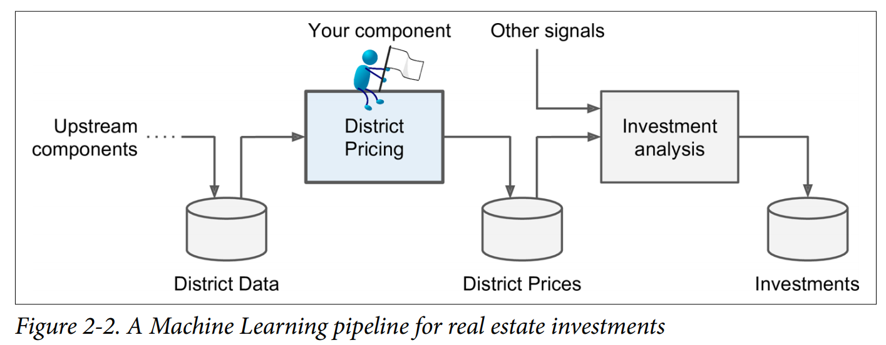

# [End-to-End Machine Learning Project](https://www.oreilly.com/library/view/hands-on-machine-learning/9781491962282/)

`End-to-End Machine Learning Project` thuộc chương 2 của cuốn sách `hands-on-machine-learning`.
Trong chương này, chúng ta sẽ xem qua một cấu trúc từ đầu đến cuối của một dự án AI.

Về cơ bản có 8 bước cơ bản đế thực hiện hoàn chỉnh một dự án AI, tùy vào tình hình hiện tại ta có thể thêm hoặc bớt các phần này:

[1. Look at the big picture.](#1.-Look-at-the-big-picture)

[2. Get the data.](#2.-Get-the-data)

[3. Discover and visualize the data to gain insights.](#3.-Discover-and-visualize-the-data-to-gain-insights)

[4. Prepare the data for Machine Learning algorithms.](#4.-Prepare-the-data-for-Machine-Learning-algorithms)

[5. Select a model and train it.](#5.-Select-a-model-and-train-it)

[6. Fine-tune your model.](#6.-Fine-tune-your-model)

[7. Present your solution.]()

[8. Launch, monitor, and maintain your system.](#7.-Launch,-monitor,-and-maintain-your-system)


## 1. Look at the big picture:  

Để có được cái nhìn tổng quan bài toán và cách thức thực hiện, ta sẽ trả lời các câu hỏi sau: 

- Mục tiêu của dự án này nhằm mục đích gì?
- Nếu bài toán đã tồn tại từ trước thì họ đã sử dụng phương pháp nào?
- Phân loại bài toán: Supervised / Unsupervised / Semisupervised / Reinforcement.
- Lựa chọn công cụ đánh giá hiệu quả của thuật toán | Performance measure?
- Kiểm tra các giả định giải quyết bài toán: có hiệu quả hay không, có bị thiếu hay lỗi chỗ nào không?

## 2. Get data:

Data là một phần không thể tách rời với AI.
- Tìm nguồn và tải data nếu chưa được cung cấp.
- Xử lý các format data đặc biệt về dạng dễ xử lý nếu cần.
- Chia bộ test ra thành: Training, validation, và test sets.

## 3. Discover and visualize the data to gain insights:
Với một khối lượng lớn data, thì Visualize tổng quát là việc cần thiết để có cái nhìn tốt về data mình đang có.
- Đánh giá mối tương quan giữa các data.
- Phân tích và xác định các thuộc tính cần thiết và loại bỏ các thuộc tính gây nhiễu.
- Đưa ra một số nhận định về thuật toán sẽ sử dụng sau khi phân tích.

## 4. Prepare the data for Machine Learning algorithms:


```
Lưu ý: 
- Làm việc trên tập data nhỏ và khó tìm kiếm thì ta nên làm trên tập copy, không làm trực tiếp trên tập data gốc.
- Tất cả các xử lý trên data cần được viết dưới dạng function để có thể ghép vào 1 Pipeline. Mục đích chính là xử lý data lúc train với data test là giống nhau.
```
- Data Cleaning: Hầu hết các thuật toán ML không thể hoạt động với các feature bị thiếu. Xử lý chúng bằng cách:

    - Get rid of the corresponding districts.
    - Get rid of the whole attribute.
    - Set the values to some value (zero, the mean, the median, etc.).

- Feature Selection.
- Feature Engineering.
- Feature scaling. 

## 5. Select and Train a Model:

Chúng ta đã định hình được vấn đề, lấy dữ liệu và khám phá nó, lấy mẫu
bộ đào tạo và bộ kiểm tra, viết các hàm để cleaning data và tự động chuẩn bị dữ liệu cho các thuật toán Học máy. 
Bây giờ ta đã sẵn sàng để chọn và đào tạo một mô hình ML.
```
Lưu ý:

- Chúng ta không nên lao đầu vào một phương pháp nào đó.
- Đầu tiên phải thử nhanh qua một vài thuật toán mà ta cho rằng CÓ THỂ PHÙ HỢP với bài toán.
- Sau đó mới tiến hành đánh giá và lựa chọn thuật toán.
- Nếu data quá lớn thì có thể làm việc với 1 phần data (nhưng cần đảm bảo 1 phần đó phải representative cho toàn tập training set).
- Tự động hoá nhiều nhất có thể.
```
- Train many quick-and-dirty model from difference categories (linear, naive bayes, SVM, random forest, neural net,…) sử dụng các tham số mặc định.
- Đo lường và so sánh hiệu quả của các thuật toán.
- Phân tích các biến ảnh hưởng nhiều nhất tới thuật toán.
- Phân tích các error của bài toán, làm sao để tránh?
- Làm lại quick feature engineering step để xem có thêm or bớt trường nào để bài toán đạt được chất lượng cao hơn không.
- Làm lại 1 hoặc 2 lần 5 bước trên.
- Chọn ra 3-5 thuật toán hiệu quả nhất.

## 6. Fine-Tune Your Model:
- Tại bước này chúng ta đi tối ưu hoá các model mà chúng ta đã lựa chọn ở trên.
- Thời điểm này chúng ta nên sử dụng toàn bộ training set của chúng ta để đưa ra được kết quả tốt nhất.

## 7. Launch, Monitor, and Maintain Your System.
- Xây dựng hệ thông monitor đánh giá và kiểm tra hoạt động của model.
- Re-train lại model thường xuyên với data được cập nhật.


