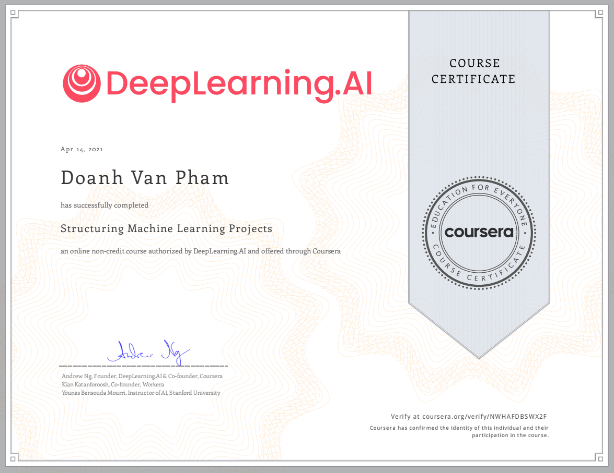

# [Structuring Machine Learning Projects](https://www.coursera.org/learn/machine-learning-projects?specialization=deep-learning)

This is the third course of the `deep learning specialization` at `Coursera` which is moderated by DeepLearning.ai. The course is taught by `Andrew Ng`.

Ở bài này, mình sẽ tóm tắt một vài kiến thức trong khóa học `Structuring Machine Learning Projects`. 

## Table of contents

* [Structuring Machine Learning Projects](#structuring-machine-learning-projects)
   * [Table of contents](#table-of-contents)
   * [Course summary](#course-summary)
   * [ML Strategy 1](#ml-strategy-1)
      * [Why ML Strategy](#why-ml-strategy)
      * [Orthogonalization](#orthogonalization)
      * [Single number evaluation metric](#single-number-evaluation-metric)
      * [Satisfying and Optimizing metric](#satisfying-and-optimizing-metric)
      * [Train/dev/test distributions](#traindevtest-distributions)
      * [Size of the dev and test sets](#size-of-the-dev-and-test-sets)
      * [When to change dev/test sets and metrics](#when-to-change-devtest-sets-and-metrics)
      * [Why human-level performance?](#why-human-level-performance)
      * [Avoidable bias](#avoidable-bias)
      * [Understanding human-level performance](#understanding-human-level-performance)
      * [Surpassing human-level performance](#surpassing-human-level-performance)
      * [Improving your model performance](#improving-your-model-performance)
   * [ML Strategy 2](#ml-strategy-2)
      * [Carrying out error analysis](#carrying-out-error-analysis)
      * [Cleaning up incorrectly labeled data](#cleaning-up-incorrectly-labeled-data)
      * [Build your first system quickly, then iterate](#build-your-first-system-quickly-then-iterate)
      * [Training and testing on different distributions](#training-and-testing-on-different-distributions)
      * [Bias and Variance with mismatched data distributions](#bias-and-variance-with-mismatched-data-distributions)
      * [Addressing data mismatch](#addressing-data-mismatch)
      * [Transfer learning](#transfer-learning)
      * [Multi-task learning](#multi-task-learning)
      * [What is end-to-end deep learning?](#what-is-end-to-end-deep-learning)
      * [Whether to use end-to-end deep learning](#whether-to-use-end-to-end-deep-learning)

## Course summary:
Khóa học này giúp:
- Biết cách chẩn đoán lỗi trong hệ thống ML, biết được các hướng xử lý để để hạn chế lỗi xãy ra.
- Hiểu cách cài đặt thuật toán ML phức tạp, chẳng hạn như train/test không đồng nhất, so sánh với độ chính xác hệ thống so với con người.
- Biết cách áp dụng phương pháp end-to-end learning, transfer learning, and multi-task learning.




## ML Strategy 1:
---

### Why ML Strategy:
có rất nhiều ý tưởng về cách cải thiện độ chính xác của hệ thống học sâu của mình:
- `Collect more data`.
- Collect more diverse training set.
- Train algorithm longer with gradient descent.
- Try different optimization algorithm (e.g. Adam).
- Try bigger network.
- Try smaller network.
- Try dropout.
- Add L2 regularization.
- Change network architecture (activation functions, # of hidden units, etc.)

Nội dung trong khóa này cung cấp `một số chiến lược` giúp phân tích vấn đề đi theo hướng đạt được kết quả tốt hơn.

### Orthogonalization:
Để hệ thống học tập có giám sát hoạt động tốt:
- Fit training set với cost function (gần bằng với con người). `Nếu nó không đạt được, có thể thử mạng lớn hơn, một thuật toán tối ưu hóa khác (như Adam) ...`
- Fit validation set với cost function. `Nếu nó không đạt được, có thể thử regularization, training set lớn hơn ...`
- Fit test set với cost function. `Nếu nó không đạt được, có thể thử validation set lớn hơn. bộ...`
- Performs well in real world. `Nếu nó không đạt được, có thể thử thay đổi validation hoặc thay đổi cost function ...`

### Single number evaluation metric:
- Its better and faster to set a single number evaluation metric for your project before you start it.

- Sử dụng Its better and faster to set a single number evaluation metric for your project before you start it.

- Sử dụng precision, recall, và F1.
    - Precision: Tỉ lệ dự đoán đúng của một class trong tất cả `dự đoán` là có của class đó.
    - Recall: Tỉ lệ dự đoán đúng của một class trong tất cả `sự thật` là có của class đó.
    - Accuracy: Tỉ lệ dự đoán đúng trên tất cả data.
    - `F1 = 2 / ((1/P) + (1/R))`

### Satisfying and Optimizing metric: 
- Lựa chọn Classifier giữa Optimizing và Satisfying
    - Chọn một chỉ số Optimizing duy nhất và quyết định rằng metrics là satisfying.
### Train/dev/test distributions:
- Validation set và test set phải đến từ cùng một phân phối.
- Validation set và test set để phản ánh đúng dữ liệu dự đoán trong thực tế.
- Setting up the dev set, as well as the validation metric is really defining what target you want to aim at.

### Size of the dev and test sets:

- Một cách chia nhỏ dữ liệu là Train set 70%, test set 30% hoặc Train set 60%, validation set 20%, test set 20%. Cách này hiệu quả với data ~< 100000
- Trong deep learning, nếu có một triệu dât trở lên, một sự phân chia hợp lý sẽ là `Train set 98%, validation set 1%, test set 1%`.

### When to change dev/test sets and metrics:
    if doing well on your metric + dev/test set doesn't correspond to doing well in your application, change your metric and/or dev/test set.

### Why human-level performance?
- Humans are quite good at a lot of tasks. So as long as Machine learning is worse than humans, you can:
    - Get labeled data from humans.
    - Gain insight from manual error analysis: why did a person get it right?
    - Better analysis of bias/variance.

### Avoidable bias:
    Avoidable bias = Training error - Human (Bayes) error
    Variance = Dev error - Training error

### Understanding human-level performance:
Khi chọn hiệu suất ở human-level, nó phải được chọn theo những gì muốn đạt được với hệ thống.

- human-level error (proxy for Bayes error)
    - Calculate `avoidable bias = training error - human-level error`
    - If avoidable bias difference is the bigger, then it's bias problem and you should use a strategy for bias resolving.
- training error
    - Calculate `variance = dev error - training error`
    - If `variance` difference is bigger, then you should use a strategy for variance resolving.
- Dev error

### Surpassing human-level performance:
Trong một số vấn đề, học sâu đã vượt qua hiệu suất ở cấp độ con người. Như là:
- Online advertising.
- Product recommendation.
- Loan approval.

## Improving your model performance: 
- The two fundamental asssumptions of supervised learning:
    - You can fit the training set pretty well. This is roughly saying that you can achieve low avoidable bias.
    - The training set performance generalizes pretty well to the dev/test set. 
    This is roughly saying that variance is not too bad.


```
- Avoidable bias - Look at the difference between human level error and the training error.
- Variance - Look at the difference between the dev/test set and training set error.
```
- Để cải thiện deep learning supervised system, hãy làm theo các nguyên tắc sau:
    - Nếu `avoidable bias` lớn:
        - Train bigger model.
        - Train longer/better optimization algorithm (like Momentum, RMSprop, Adam).
        - Find better NN architecture/hyperparameters search.
    - Nếu `variance ` lớn:
        - Get more training data.
        - Regularization (L2, Dropout, data augmentation).
        - Find better NN architecture/hyperparameters search.

## ML Strategy 2:
----

### Carrying out error analysis:
Phân tích lỗi - kiểm tra thủ công các lỗi mà thuật toán đang mắc phải. Nó có thể cung cấp thông tin chi tiết về những việc cần làm tiếp theo. Ví dụ.:

- Trong ví dụ phân loại mèo, nếu có 10% error trên validation set của mình và muốn giảm lỗi.
- Phát hiện ra rằng một số dữ liệu bị dán nhãn sai: `hình ảnh labeled là chó trông giống con mèo`.

- Phương pháp phân tích lỗi:
    - Lấy ngẫu nhiên 100 data trong validation set bị gắn nhãn sai.
    - Đếm xem có bao nhiêu con chó.
    - Nếu 5/100 là chó thì việc huấn luyện bộ phân loại đối với chó sẽ giảm lỗi lên đến 9,5% (called ceiling), có thể là quá ít.
    - Nếu 50/100 là chó thì có thể giảm lỗi của mình lên đến 5% => cố gắng làm cho bộ phân loại mèo hoạt động tốt hơn trên chó.

    (`TODO`: ở đây tôi chưa chắc chắn với kiến thức này)
### Cleaning up incorrectly labeled data:
### Build your first system quickly, then iterate
The steps you take to make your deep learning project:
- Setup dev/test set and metric
- Build initial system quickly
- Use Bias/Variance analysis & Error analysis to prioritize next steps.

### Training and testing on different distributions:
- Có một số chiến lược cần theo dõi khi phân phối training set khác với phân phối tập dev/test set.
    - Option one (not recommended): `shuffle all the data` together and extract randomly training and dev/test sets.
        - Advantages: all the sets now come from the same distribution.
        - Disadvantages: the other (real world) distribution that was in the dev/test sets will occur less in the new dev/test sets and that might be not what you want to achieve.
    - Option two: `take some of the dev/test set examples and add them to the training set`.
        - Advantages: the distribution you care about is your target now.
        - Disadvantage: the distributions in training and dev/test sets are now different. But you will get a better performance over a long time.

### Bias and Variance with mismatched data distributions:
Bias và Variance thay đổi khi training set và  Dev/test set có phân phối khác nhau.
### Addressing data mismatch:
- Tiến hành phân tích lỗi để cố gắng hiểu sự khác biệt giữa tập huấn luyện và dev/test.

- Làm cho dữ liệu đào tạo tương tự hơn hoặc thu thập nhiều dữ liệu tương tự như bộ dev/test.

### Transfer learning
### Multi-task learning
### What is end-to-end deep learning?
### Whether to use end-to-end deep learning
